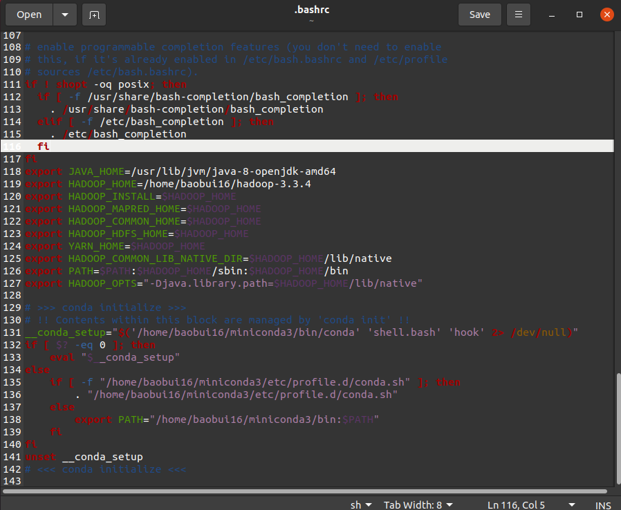
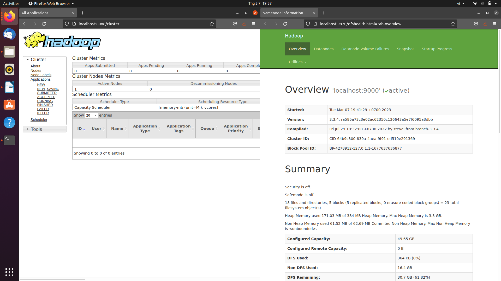

# Lab 01: A Gentle Introduction to Hadoop

## How much work, in percent (%),have you finished in each section?

  **My team works in section**

      |  Section 1 |  Section 2 | Section 3  |  Section 4 |
      |------------|------------|------------|------------|
      |     100%   |     100%   |    100%    |     25%    | 

      (In section 4 we just done section 4.1 and we can't do section 4.2)

## Setting up Single-node Hadoop Cluster
- Install java
  

- Check java settings and path
  

- Install openSSH
  

- Create and Install SSH Certificates
  

-  Configure file core-site.xml
  

- Configure the file mapred-site.xml
  

- Configure file hdfs-site.xml
  

- Configure file yarn-site.xml
  

- Configure file hadoop-env.sh
  

- Configure file bash
  

- Successful installation
  

### SET SUCCESS OF TEAM MEMBERS:
- 20127444 - Bùi Duy Bảo
  

- 20127049 - Nguyễn Đức Minh
  

- 20127092 - Nguyễn Minh Tuấn
  

- 20127448 - Nguyễn Thái Bảo
  

   

## Introduction to MapReduce
1. **How do the input keys-values, the intermediate keys-values, and the output keys-values relate?**
  
The input keys-values represent the input data that is read from HDFS or other data sources

The intermediate keys-values are generated by the map tasks during the processing of the input data, and are in a different format or schema than the input data. These intermediate pairs are then sorted and shuffled across the cluster, and sent to the reduce tasks for further processing.

The output keys-values are the final key-value pairs generated by the reduce tasks, and are the result of aggregating, summarizing, or transforming the intermediate pairs

Overall, the input keys-values, intermediate keys-values, and output keys-values are all important components of the MapReduce data processing model, and they are all related to each other in the sense that they represent different stages in the processing of data on a distributed cluster.

2. **How does MapReduce deal with node failures?**
   
MapReduce deals with node failure by being designed to be fault-tolerant and by using some techniques, for example data replication and job restart even node failure appears.

About by being designed to be fault-tolerant: it means that MapReduce can handle node failures and continue processing the job. If a node fails, the tasks running on that node are automatically reassigned to other available nodes. The framework also periodically pings the nodes to check if they are still alive. If a node does not respond, it is assumed to have failed, and its tasks are reassigned to other nodes.

About by using data replication: MapReduce uses this technique to ensure that data is not lost when node failure happens, each block of data is replicated across multiple nodes in the cluster. If one node fails, the data is still available on the other nodes, and the job can continue processing.

About by using job restart: in this situation, the entire job may need to be restarted. This is because if a node fails while processing a task, the output of that task may be lost. If the output of a task is lost, any subsequent tasks that depend on that output will need to be rerun.

3. **What is the meaning and implication of locality? What does it use?**
   
The locality is input data is stored on the local disks of the machines that make up cluster.
It’s manager by GFS which divides each file into 64 MB blocks, and stores several copies of each block (typically 3 copies) on different machines,if it had any node fail ,GFS would be specify another node that contains the copy in order to comply with the minimum requirement, 3 copies must be obtained

It’s used when running large MapReduce operations on a significant fraction of the workers in a cluster, most input data is read locally and consumes so it not need to spend network bandwidth

4. **Which problem is addressed by introducing a combiner function to the MapReduce model?**
   
Combiner Function is similar to small Reduce phases of each Mapper on local disk which helps the process decrease number of pairs (key-value) before Reduce phases. As we see, reducing pairs of key-value on local disk decreases the workload that enhance bandwidth quality to run the process faster.

## Running a warm-up problem: Word Count
- Check Hadoop version
  

- The input directory contains the file input.txt
  

- Enter the following path to export the Hadoop classpath to bash
- Make sure it's now exported

- Create this directory on HDFS and put input.txt . file

- Run file jar on Hadoop
  

- Output 
  

    
    
## Bonus
4.1 Extended Word Count: Unhealthy relationships
- Input 
  

- Output 
  

- Directory containing output on hadoop

  

- Visualize example
  

## Reflection of your team. (Does your journey to the deadline have any bugs? How have you overcome it? What have you learned after this process? If you cannot overcome the bugs, describe where the bottlenecks are in your work.)

 - In process , we have some problem about setting up Hadoop  in make enviremnt so we need to uninstall ubuntu and resetup after that
 - when we run Wordcount and expand wordcount problems , we had error in output of map and input of reduce not correct so we search in google and see solusion by some people 
 - After this lab , we can operate MapReduce and custom MapReduce in high level.
 - We try to install full hadoop distribution mode but can't.

## References
<!-- References without citing, this will be display as resources -->
- Two Cloudera version of WordCount problem:
    - https://docs.cloudera.com/documentation/other/tutorial/CDH5/topics/ht_wordcount2.html
    - https://docs.cloudera.com/documentation/other/tutorial/CDH5/topics/ht_wordcount3.html

- Apache Hadoop

    - [1] Apache Hadoop 3.3.4 – Hadoop Cluster Setup. https://hadoop.apache.org/docs/current/hadoop-project-dist/hadoop-common/ClusterSetup.html.

    - [2] Apache Hadoop 3.3.4 – Hadoop in Secure Mode. https://hadoop.apache.org/docs/current/hadoop-project-dist/hadoop-common/SecureMode.html.

    - [3] Apache Hadoop 3.3.4 – Hadoop: Setting up a Single Node Cluster. https://hadoop.apache.org/docs/stable/hadoop-project-dist/hadoop-common/SingleCluster.html.

    - [4] Apache Hadoop 3.3.4 – MapReduce Tutorial https://hadoop.apache.org/docs/current/hadoop-mapreduce-client/hadoop-mapreduce-client-core/MapReduceTutorial.html#Example:_WordCount_v1.0.

- Book: 
   - MapReduce Design Patterns [Donald Miner, Adam Shook, 2012]
   - [5] Jeffrey Dean and Sanjay Ghemawat. MapReduce: Simplified Data Processing on Large Clusters.
     In OSDI’04: Sixth Symposium on Operating System Design and Implementation, pages 137–150,
     San Francisco, CA, 2004.

- All of StackOverflow link related.
  -   https://stackoverflow.com/questions/56153007/java-lang-exception-java-io-ioexception-wrong-value-class-while-setting-hadoop?fbclid=IwAR1UNjMqPVvXy9nMberqIHAYFNZ02q0we1BAoqZOGUhmEFArVmbnBfyoCiQ

  - https://stackoverflow.com/questions/58272650/what-exactly-does-data-locality-mean-in-hadoop?fbclid=IwAR0jSqFAXazrxBUA7uO8sZsGWbhkry6SYJAf4PtBEbNfilKoZcl6HTBbdLk

- Another link 
  - https://community.cloudera.com/t5/Support-Questions/class-org-apache-hadoop-io-MapWritable-is-not-class-org/m-p/136602?fbclid=IwAR3VazsXyHo688u4UyNvsBdj_a_2hOwuJ-KpGZD6fg4aMwW8trQlpz-KArA
  - https://www.thoughtworks.com/insights/decoder/d/data-locality?fbclid=IwAR1BwoHh0Q8-hylq51ylms9NIWQI300GMKdZm4yydbQkEDBWhrbcqQoM554
  - https://www.tutorialspoint.com/map_reduce/map_reduce_quick_guide.html
  - https://www.youtube.com/watch?v=6sK3LDY7Pp4&t=483s
  - https://www.youtube.com/watch?v=MZ_FUEnbrR4

